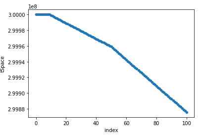

# Burnable Reflection Token 

this project contains reflection token with burn feature .
the correctness of the logic had been tested in jupyter. 

Reflection helps to share profits to all token holders, based on the value they staked. 
 

## Running Tests

To run tests, run the following command

```bash
  yarn run test
```
Run `TEST.ipynb` to see the outputs of jupyter . this is tSpace after 100 transactions with different amount. 





## Acknowledgements

for technical detail about reflection token see this [link](https://reflect-contract-doc.netlify.app/)

## Authors

- [@mamadeusia](https://github.com/mamadeusia)

